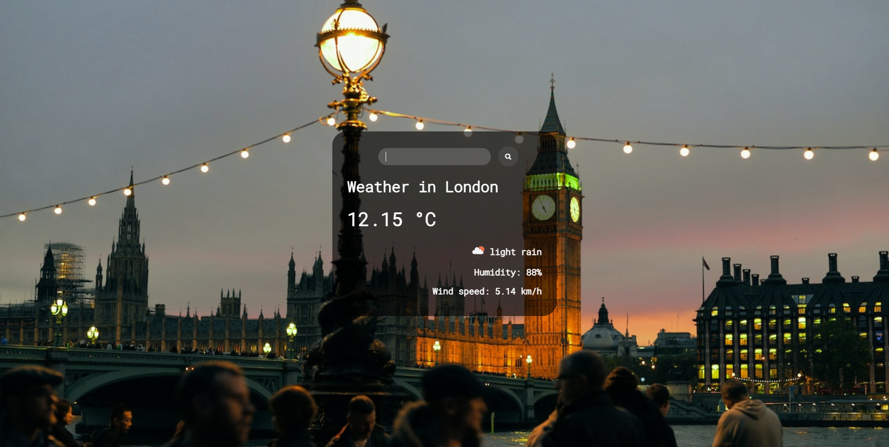

# Weather App 🌦

### Demo - Deployed over Github Pages

### APIs Used
[Open Weather APIs](https://yoma963.github.io/weather_app/)

### API Info
* Method: `GET`
* URL: `https://api.openweathermap.org/data/2.5/weather?q=${city}&units=metric&appid=${apiKey}`

### Icons & Font -
* Icons Link: `<link rel="stylesheet" href="https://cdnjs.cloudflare.com/ajax/libs/font-awesome/4.7.0/css/font-awesome.min.css">`
* Font Link: `<link href="https://fonts.googleapis.com/css2?family=Roboto+Mono:wght@300&display=swap" rel="stylesheet">`

---

### Give a Star ⭐

If you like this project then give it a **Github** star by pressing the **Star** button ⭐
